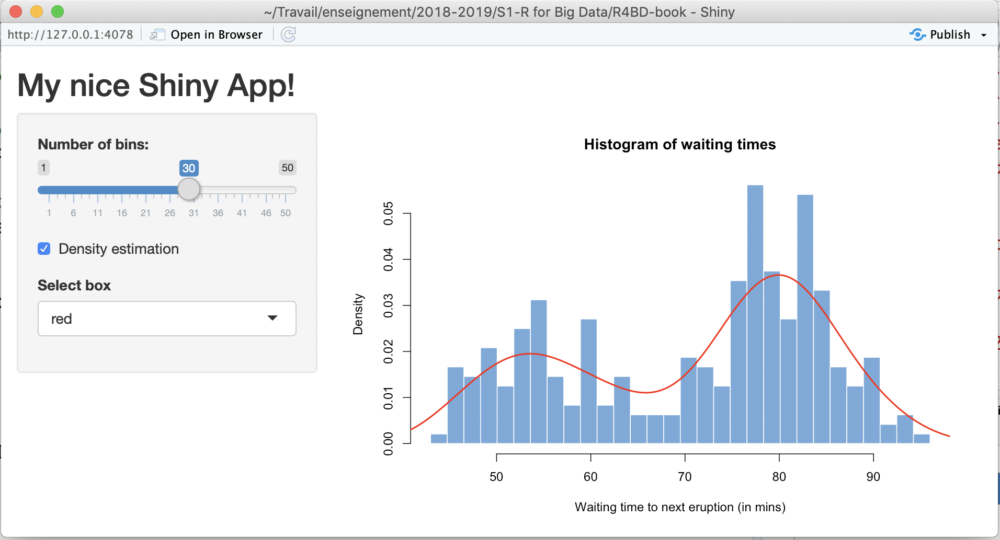

```{r setup, include=FALSE}
knitr::opts_chunk$set(echo = TRUE)
```

# Reporting with R

Several very useful tools for reporting and communication are available within the R ecosystem. 

## Rmarkdown

Rmarkdown is a comprehensive way of creating reports which involve R (or other languages). A synthetic presentation of the Rmarkdown system is available here: <https://rmarkdown.rstudio.com/lesson-1.html>. For advanced details on the language, please refer to <https://bookdown.org/yihui/rmarkdown/>.

The basic commands of Rmarkdown:

* the `#` allows to organize the document in sections, subsections, ... The more you add `#`, the more you go down into the subsections, subsubsections, ...
* the `*` allows to higlight some part of the text: if you use one `*tyty*` it produces *tyty*. If you use `**tyty**`, the text **tyty** will be in bold.
* the `>` allows to create some "citation / remark box": 
> The citation that I would like to highlight!

* It is possible to provide online code using single quote. As an exemple: `ls()`.

It is also possible to provide parts of code, that are enventually run:
```{r eval=FALSE}
# Put here some lines of code
# that you would like to show and/or execute
```
There are several options:

  * the first one is the language to use (here, R),
  * the `echo` option allows to disable the display of the output. Notice that the code is however run and you can use later its ouptput!
  * the `include` option allows to hide both the code and the output (even though the code is run and the output exists in the memory).
  * the `eval` option  disables the execution of the code.

The different outputs for the Rmd file are either HTML, PDF or Word documents. Such files are very useful for instance to produce recurrent reports which load some new data and do the same statistical anylys evry week, month,...

An example:

* start a Rmd document, write some R chunck to draw some data from a Gaussian distribution, and plot both an histogram and an estimation of the density, without displaying the R code necessary to produce the graph.

```{r,echo=FALSE,fig.cap='This is the caption of the figure',fig.align='right'}
mu = 2; sigma = 1
x = rnorm(1500,mu,sigma)
hist(x,breaks = 50,freq = FALSE, col='lavender')
lines(density(x),col='red',lwd=2)
```

Here is an histogram plot with `r length(x)` observations from a Gaussian distrubution with mean `r mu` and standard deviation `r sigma`.

> Notice that it is possible to incorporate information about the data directly into the text using inline chuncks. Those chuncks should start with a `r` to be executed inline.

Some advances commands:

* hyperlinks can be used with either `<http://mysite.web>` or `[texte describing the link](http://mysite.web)`. The result is <http://mysite.web> or [texte describing the link](http://mysite.web).
* images can be incorporated in the document with the ``.
* it is possible to start a table within the document:

| Right | Left | Default | Center | 
|----|----|----|----|
| 12 | 12| 12 | 12|
| 123 | 123 | 123 | 123 |
| 1 | 1 | 1 | 1 |

* it is possible to draw a horizontal line to seperate some parts of the text using `***`

A first text

***

A new part of the text

## Shiny

The `shiny` package for R is a great way to creat interfaces with some R codes. A shiny code creates a web page with JavaScript which allows the user to execute some (hidden) R code and look at the results in a very easy way.

```{r eval=FALSE}
#install.packages('shiny')
library(shiny)
runExample("01_hello")
```

To start a Shiny app, you have to creat two files: 

* `ui.R` is devoted to design the user interface,
* `server.R` is running the R codes conditionnaly to the options set by the user through the interface.

The two minimal files [ui.R](./ui.R) and [server.R](./server.R) can be used to start a new app project. For more details on the desiging of Shiny App, please refer to <http://shiny.rstudio.com/tutorial/>.

This is the result of slight modifications of this minimal examples:




# Programming with R

## Basics of R programming

First, R has loops and advanced function to write efficient code:

* the `for` loop is probably the most useful. The `for` loop should be used when the number of iterations is known in advance. The syntax for the `for` loop is: `for (i in list_of_elements) { lines of codes to evaluate}`.

```{r}
for (i in 1:10){ print(i)}
```

```{r}
#my.list = seq(1,20,by = 2)
my.list = runif(10,0,1)
for (i in my.list){print(i)}
```

* the `while` loop is also existing in R. The syntax is: `while (condition) {lines of codes}`.

```{r}
eps = 10
while (eps > 0){
  print(eps)
  eps = eps - 1
}
```

* the `switch` function exists as well but it is unfortunately not very convenient. The syntax is: `switch(var,1 = action1(x),2 = action2(x),...)`.

```{r}
fun = 2
switch(fun,plot(x<-seq(0,4*pi,length.out = 100),sin(x),type='l'),
       plot(x<-seq(0,4*pi,length.out = 100),cos(x),type='l'))
```

* the `apply` function allows to replace `for` loops when applied to data.frames, vectors, ... The syntax is the following: `apply(my.data.frame,direction,the.function.to.apply)`, where:
+ `direction = 1` if we would like to work on rows,
+ `direction = 2` if we would like to work on columns,
+ `the.function.to.apply` can be a pre-existing function or a function defined locally.

```{r}
X = iris[,-5]
max.row <- apply(X,1,max)

max.row2 = c()
for (i in 1:nrow(X)){
  max.row2[i] = max(X[i,])
}

sum(max.row != max.row2)
```

> Remark: the `apply` function should be faster than the `for` loop equivalent for large datasets.

```{r}
X = iris[,-5]
res <- apply(X,1,function(x){sum(x) / x[2]})
length(res)
```

> Exercise: compute the standard deviation for all variables of the `iris` dataset by using the apply function.

```{r}
X = iris[,-5]
mean = apply(X,2,sd)
mean
```

## Defining functions

To define a new function (your own function), the syntax is very simple:

```{r, eval=FALSE}
my.function <- function(x,y,...){
  a first line of code
  a second line of cod
  result
}
```

Some elements of the definition are very important and mandatory:

* the reserved word `function`,
* the brackets to delimit the function,
* the result object on the last line (usually a list),
* the `...` operator allows the user to provide additional arguments to sub-functions which are called in my function.

> Exercise: write a newx funtion `my.hist` which plot for some data `x` an histogram with an estimation of the density.

```{r}
my.hist <- function(x,...){
  hist(x,freq = FALSE,col='lavender',...)
  lines(density(x),col='red',lwd=2,...)
}

# Use the new function
x = rnorm(1500,2,1)
my.hist(x,breaks=25,lty=2)
```

## Building R packages

Finally, it is possible to build your own R packages for either ease the communication of your work with colleagues or provide it to the R community through the CRAN repository.

The building of package is usually a 4 step-process:

* first, start an R script to write a first daft code that should work,
* second, create some functions from the code to isolate some specific actions in the functions,
* third, create the skeleton of your package and write the documention of all functions and data that you would like to add to your packages,
* eventually, submit to the CRAN repository your package.

Let's try to build a very simple package based on `my.hist` function.

```{r, eval=FALSE}
# First, start with a clean environment
rm(list = ls())

# Then, load only the elements that you would like to have
# in the package
my.hist <- function(x,...){
  hist(x,freq = FALSE,col='lavender',...)
  lines(density(x),col='red',lwd=2,...)
}
my.data = rnorm(1500,2,1)

# Finally, create the skeleton of your package
package.skeleton("my.hist")
```

After having completed all documentation files, it is possible to build the package. To do that, you have to open a bash terminal and type in the right directory: 

```{bash, eval=FALSE}
R CMD build my.hist
```

# Handling massive data with `dplyr`

When working to massive data sets, simple query can be long when either the number of rows or columns is very large. The idea of the `dplyr` package (which is part of the `tidyverse` collection) is to access and manipulate the data in a more natural way.

Let's first install the package and some big data set to practice:

```{r}
#install.packages('dplyr')
#install.packages('nycflights13')

library(dplyr)
library(nycflights13)
```

We know have in memory a big data set named `flights` of 336,776 flights which departed from NYC in 2013.

The `dplyr` package introduces some new functions to manipulate the data:

* `filter()` fonction allows to conditionnaly select some data from the whole data set,
* `arrange()` fonction which sorts the data set according to some variables,
* `select()` function which is able to pick variables by names,
* `mutate()` functions wchich allows to create new variables,
* `summarise()` function which allows to get some summury about the data.

## The `filter` function

The syntax to work with all `dplyr` functions (and therefore this one) is very natural: `filter(dataset,var1 > 2,var2 < 3)`. It is not necessary to specify every time `dataset$var1`!

```{r, eval=FALSE}
# The dplyr way
out <- filter(flights,origin == 'JFK',dest == 'BOS')

# The old-fashion alternative
out2 <- flights[flights$origin == 'JFK'  & flights$dest == 'BOS',]
```

> Exercise: extract all flights that flew from JFK to Boston after November 1st, 2013 and that arrived with a delay larger than 30 min.

```{r}
out = filter(flights,origin=='JFK',dest=='BOS',month %in% c(11,12), arr_delay >= 30)
dim(out)
```

Here, we now know that `r nrow(out)` flights flew from JFK to Boston after November 1st, 2013 and that arrived with a delay larger than 30 min.

## The `arrange` function

This function allows to sort the data set according to one or several variables. For instance, we can sort by departure day and by departure time all flights that flew in January.

```{r}
flightsJan = filter(flights,month==1)
ordFlightsJan= arrange(flightsJan,day,arr_delay)
```

This code reordered the data frame according to days and arrival delays.

## The `select` function

This is a quite naive function which allows to extract a few variables from a data frame:

```{r}
out = select(flights,month,day,dep_time)
dim(out)
```

## The `mutate` function

The `mutate` function allows to add some new variables to the data set by combining several of the existing variables: 

```{r}
flights2 = mutate(flights,gain = dep_delay - arr_delay)
dim(flights)
dim(flights2)
```

## The `summarise` function

Summarise is a function that allows to obtain summary information about the dataset:

```{r}
my_summary = summarise(flights,
            dep_delay_m=mean(dep_delay,na.rm = TRUE),
            arr_delay_m = mean(arr_delay,na.rm=TRUE),
            arr_time_sd = sd(arr_time,na.rm=TRUE))
my_summary
```

To summarize, the summary function allows to personalized the summaries compared to the usual `summary` function of the `base` package which always provides the same summaries.

The `summarise` fonction becomes more useful when you combine it with the `group_by` function. This allows to get summaries that are group dependent, and you specify the groups.

```{r}
my_groups = group_by(flights,month)
summarise(my_groups,
            dep_delay_m=mean(dep_delay,na.rm = TRUE),
            arr_delay_m = mean(arr_delay,na.rm=TRUE),
            arr_time_sd = sd(arr_time,na.rm=TRUE))
```

> Exercice #1: relationship between the delay and the distance, according to the months

```{r}
flights2 = mutate(flights,
                  delay = dep_delay + arr_delay)
my_groups = group_by(flights2,month)
sum = summarise(my_groups,
          tot_delay = sum(delay,na.rm = TRUE),
          tot_distance = sum(distance,na.rm = TRUE),
          nb_flights = n())
sum = mutate(sum, norm_delay = tot_delay / nb_flights)
sum
```

Here, we can finally conclude that there is a seasonal effect on the delay (probably due to the touristic period).

```{r}
library(ggplot2)
ggplot(sum) + geom_line(aes(x = month,y = norm_delay))

```

```{r}
library(ggplot2)
ggplot(sum) + geom_point(aes(x = tot_distance,y = norm_delay),alpha=0.3)

```

> Exercice #2: count the number of flights per month and per destination

```{r}
my_groups = group_by(flights,month,dest)
sum2 = summarise(my_groups,count = n())
sum2
```

> Remark: the `n()` function counts how many observations are in the groups that are formed by the the `group_by` function 

## The pipe `%>%` operator

The pipe operator is known in several languages, such as the `bash` language. It aims at providing the result of a first action to another action without needing to store the intermediate result(s). 

Of course, since it is not possible to see the intermediate results, the pipe operator should be used with caution, on actions that are well understood.

In `R`, the pipe operator is provided by the `magrittr` and the syntax is `%>%`. So now, we can reformulate the actions that we used before with the pipe:

```{r}
flights %>% mutate(delay = dep_delay + arr_delay) %>%
  group_by(month) %>%
  summarise(tot_delay = sum(delay,na.rm = TRUE),
          tot_distance = sum(distance,na.rm = TRUE),
          nb_flights = n()) %>%
  mutate(norm_delay = tot_delay / nb_flights)
```

> Remark: in a chain of actions, the data are always grouped after the `group_by` function unless the `ungroup` function is called. After this call, the data set will recover is initial form.

# Relational data, dates and maps

## Relational data

In most situations, the information is not stored in a single data frame, because the data are too complex and/or too large to be replicated in a single file. In such a case, we prefer usually to work with several data files that are connected through identification numbers (called primary keys).

Those identifications are very important to keep as is in order to be able to connect the tables and also to produce results that are exploitables.

To join two different tables, the `inner_join`, `left_join`, `right_join` and `full_join` allows to join tables with common identification ids.

```{r}
X = data.frame(id = c(1:5,5,7), x = runif(7), a = runif(7))
Y = data.frame(id = 6:1, y = seq(-10,-5))
X
Y
```


```{r}
Z = inner_join(X,Y,by = "id")
Z
```

In case the two tables do not have the same name for the indification variable, you have to specify the two variables in the `by` parameter: `by = c('id1' = 'id2')`.

```{r}
full_join(X,Y,by = "id")
```


```{r}
right_join(X,Y,by = "id")
```


```{r}
left_join(X,Y,by = "id")
```

## Temporal data (dates)

In R, temporal data have their own types to be recognized as dates. This allows in particular to manipulate those data as dates and not only continuous variables.

A basic input for dates is as follows:

```{r}
today = '2018-11-22'
some_other_day = '2018-11-12'
today
class(today)
#today - some_other_day

today = as.Date(today)
some_other_day = as.Date(some_other_day)
today
class(today)

today - some_other_day

range(c(today,some_other_day))
```

When working with dates, it would be possible to see the temporal distribution of the flights over 2013:

```{r}
flights = mutate(flights,date=as.Date(paste(year,month,day,sep='-')))
hist(flights$date,breaks = 'days')
```

```{r}
dates = c(paste('2018:Jan-',1:31,sep=''),
          paste('2018:Feb-',1:28,sep=''),
          paste('2018:Mar-',1:30,sep=''))
dates

dates2 = as.Date(dates,format = "%Y:%B-%d")
dates2
```

## Maps

Actually, R is pretty good for displaying and manipulating maps. R is even recognized as a good software by geographers and they use it a lot to display information on very different maps.

There a lot of packages dedicated to drawing maps: `maps`, `ggmap`, `leaflet`, ...

The first 'historical' package is the `maps` one, which is provided by R core.

```{r}
library(maps)
map()
```

Then, it is very easy to add information on this map by using `points()`, `lines()` or `text()` with the GPS positions of the elements that we would like to display.

```{r}
X = data.frame(lat = c(45, 46, 47), long = c(32,25,5))
map()
points(X$long,X$lat,pch=19,col='red',cex=1)
```

> Exercice: draw a map of all connections between NY airport and all airports of the world

```{r}
X = data.frame(faa2 = as.factor(unique(flights$dest)))
airports = mutate(airports, faa2 = as.factor(faa))
Y = left_join(X,airports,by = 'faa2')

map(database = 'state')
points(Y$lon,Y$lat,pch=19,col='red',cex=1)
```

The `ggmap` library allows to draw more fancy maps by relying on GoogleMaps, OpenStreetMap, ...

```{r eval=FALSE}
#install.packages('ggmap')
library(ggmap)

myMap = get_stamenmap()
ggmap(myMap) + geom_point(Y,aes(x = lon,y = lat))
```

With `leaflet`, we can also get some nice maps:

```{r}
#install.packages('leaflet')
library(leaflet)

m <- leaflet() %>%
  addTiles() %>%  # Add default OpenStreetMap map tiles
  addMarkers(lng=174.768, lat=-36.852, popup="The birthplace of R")
m  # Print the map
```
